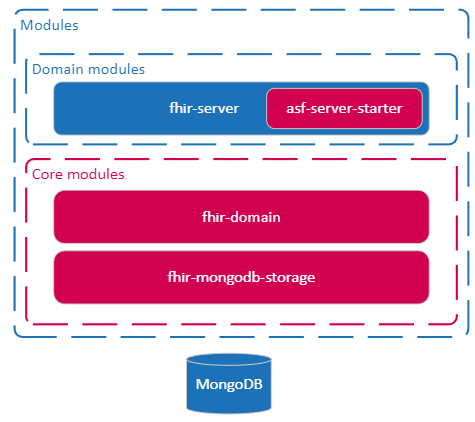

# Architecture technique

## Contexte

L’application annuaire-sante-fhir-serveur est une application qui permet d’exposer un serveur FHIR avec les profils FHIR
publiques de l'ANS.

Il s’agit d’une application monolithique stateless qui expose une api REST en utilisant une base de données MongoDB.

## Langage, outils et Frameworks

Le projet est un projet java Spring boot.

L'implémentation de base du serveur stock les données sur une base de données MongoDB.

## Architecture

### Vision globale

L’application est un serveur Java qui expose un serveur HTTP et une api REST FHIR. Pour stocker les données FHIR il
utilise une base de données MongoDB.

### Vision Composant

{ width=50% }

#### fhir-domain

Le module fhir-domain contient des classes et utilitaires génériques sur le serveur.
Il y a par exemple les interfaces lies au système de recherche (implémentés par le module fhir-mobgodb-storage en mongodb).
Le module contient également quelques classes utilitaires non liées au type de persistance.

#### fhir-mongodb-storage

C'est l'implémentation Mongodb du système de recherche et stockage FHIR. 
Tous les éléments spécifiques à mongodb sont présents dans ce module (et uniquement dans ce module).
En cas de changement dus système de persistance, il n'y a que ce module à modifier.

#### fhir-server-test-lib

Ce projet est un projet utilitaire pour les tests. Ce n'est pas déployé sur le serveur en run. 
Quand ce module est ajouté en dépendance, veuillez ajouter la dépendance uniquement pour les tests. 

```xml
<dependency>
    <groupId>fr.ans</groupId>
    <artifactId>fhir-server-test-lib</artifactId>
    <version>${project.version}</version>
    <scope>test</scope>
</dependency>
```

Parmi les utilitaires pour les tests, il y aura des classes pour lancer des tests avec testcontainers. 

#### afas-server-starter

C'est un module spring boot starter qui permet d'utiliser le système afas avec la mécanique spring boot "AutoConfiguration".


#### project-report 

Le module est un module vide uniquement utilisé à des fin techniques pour l'intégration continue. 
Il permet de faire du coverage avec jaccoco. 
